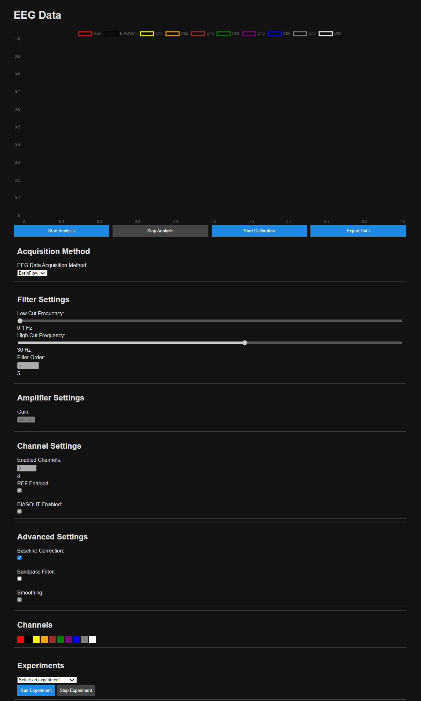
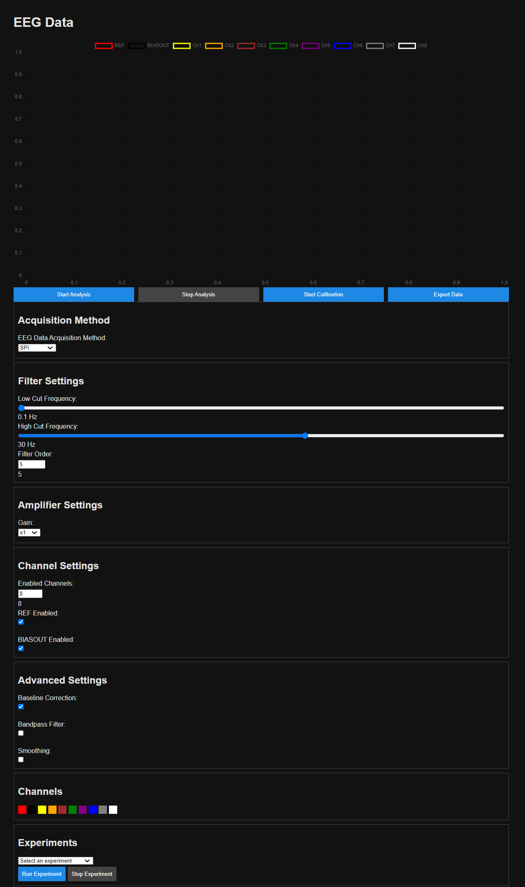
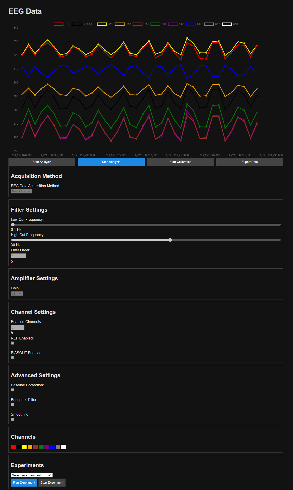
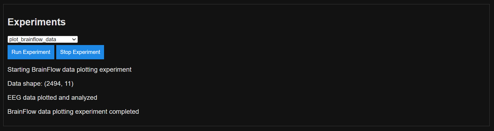
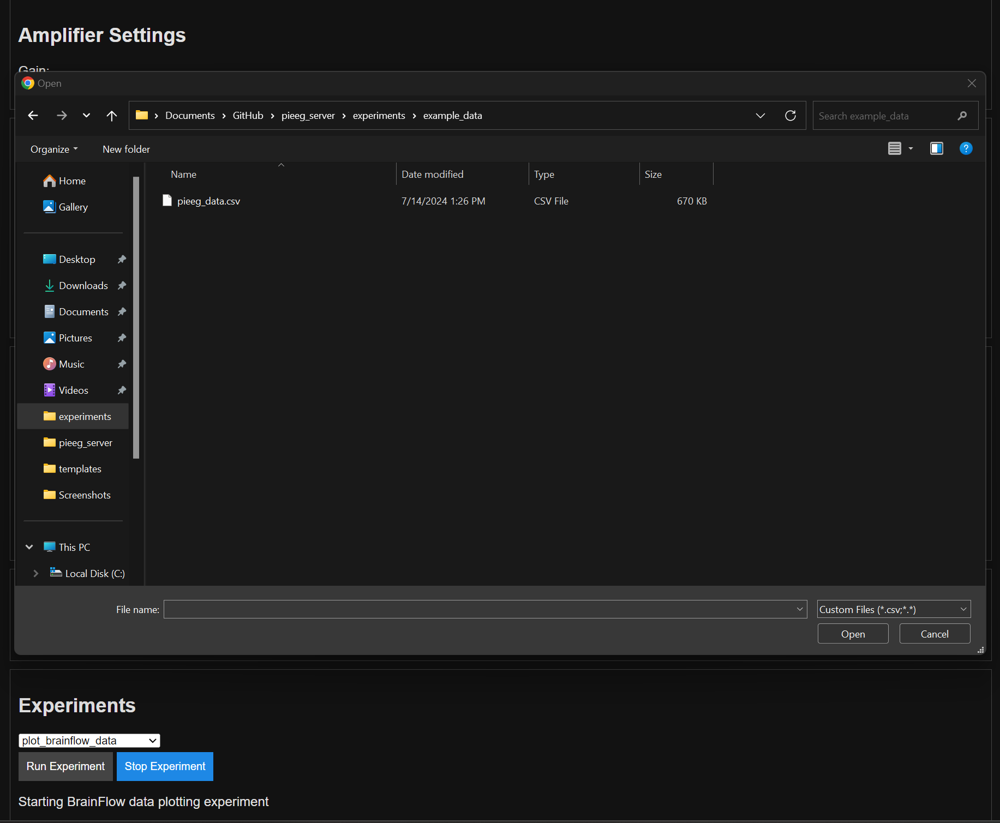
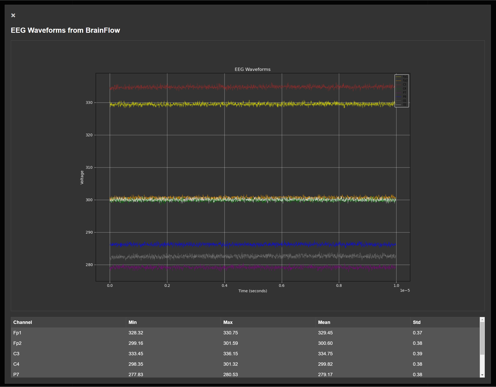

#MindGarden EEG Server & Client App

This is the MindGarden EEG Server & Client App. This Python Flask application runs on the MindGarden EEG Headset and acts as a primary research platform and interface for the MindGarden EEG Headset. 

## Screenshots
<!-- screenshots start -->

  
  
  
  
  
  
  
  
  

<!-- screenshots end -->

## Setup

## Getting started
